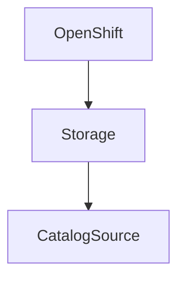

# Deploying cloud pak for data 4.5 on self managed openshift cluster in op-perm environment

Cloud Pak for data is a comprehensive Enterprise level datafabric and datascience platform. 

This document will show how 

### Requirements

* [ ] OpenShift 

> OpenShift version 4.6 or higher
minimum 3 worker nodes with 16vCPU and 64GB RAM, 300GM localstorgae

* [ ] Persistent Storage 
1 TB persistent storage

* [ ] 

