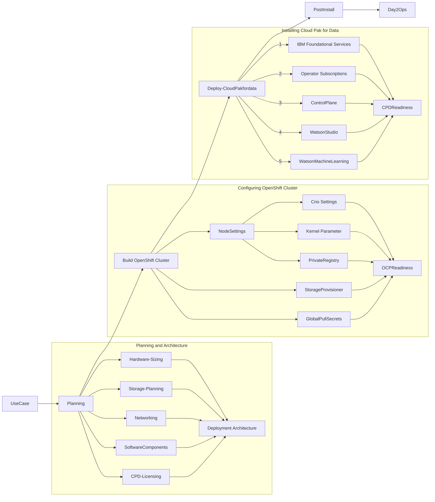
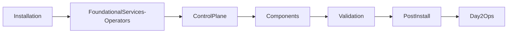

# Deploying cloud pak for data 4.5 in a self managed openshift cluster

Building a data science and AI platform in an on-perm infrastructure requires careful planning and right skillsets. IBM Cloud Pak for data is a comprehensive end-to-end enterprise level datafabric and datascience platform. The following document shows, how easily and quicly it can be built on on-perm infrastructe of the organization.


### 1.0 Deployment Planning


#### 1.1 Architecture

IBM Cloud Pak for Data is comprehensive Datafabri/AI/ML/DataScience platform which can be built to scale from few users to thousands of business and datascientis and developers. Identifying the usecase will help sizing the hardware, planning the Network and software component requirements for deployment. 

In this example, We are building the IBM Cloud Pak for Data cluster for building DataScience platform for Developers, Data Scientists to build ML/AI models and deploying to model to infusing in to the business applications.

Examples of this POC Usecase includes:
- Data Scientists in this organizations prefer the R-studio and Python for building ML models
- Data in Hadoop/Hive, Relatioan Database systems, those will used for Model training and testing 
- Deploy multiple ML Models in production-ready environment
- Models need to be monitored for drift and model bias
- Embed ML scoring end-point with web based business application

What are the minimum Software components required:
- IBM RedHat OpenShift - IBM's Enterprise level kubernetic platform, Entitlement is provided as part Cloud Pak for Data license
- Cloud Pak for Data  - IBM's Enterprise level Datafabric and Data Science platform
- Cloud Pak for Data Components
  - Watson Studio, R-Studio, Jupyter Notebook - Development
  - Watson Machine Learning - Model Runtime environment and Auto AI Creation


Sizing of the hardware, storage are based on the number of concurrent users, concurrent models to be running and number of Cloud Pak for Data components will be installed.


#### 1.2 Requirements

* OpenShift Cluster 4.8.x
* Private Container Image Registry
  
  Image Registry supporting with Docker Version 2 Schema2
  
* Cluster Compute resource requirements
  * [ ] Minimum 3 worker nodes
  * [ ] Each nodes should be of minimum 16vCPU, 64GB RAM and 300GB RAM
  * [ ] Total cpu and memory requirements are calculated based components to be installed.
  * [ ] Image Registry supporting with Docker Version 2 Schema2

* Storage
  * [ ] Minimum 1 TB Persistent volume storage
  * [ ] Minimum 500GB Registry storage 
  
* Cloud Pak for Data 4.5 and Service
  * [ ] Cloud Pak for Data control plane
  * [ ] Watson Studio
  * [ ] Watson Machine Learning
  * [ ] Watson Knowledge Catalog  

* Network access Requirements
  * IBM Entitlement Registry and Software Image
    * [ ] icr.io/cpopen
    * [ ] cp.icr.io/cp
    * [ ] quay.io
    * [ ] docker.io
  * Cloud Pak for Data client tools
    * [ ] github.com/IBM

* License
  * [ ] IBM Cloud Pak for Data Standard/Enterprise license 
  * [ ] IBM Entitlement API Key (myibm.ibm.com)

* User Permissions
  * [ ] OpenShift Administrator
  * [ ] Cloud Pak for Data administrtor
  * [ ] Read/Write permission to private registry (when used)

* Bastion Host
  * RHEL 8.x node
  * 4 vCPU, 8GM RAM, 500 GB disk 
  * Internet access to IBM entitlement registry
  
#### 1.3 Deployment Flow





### 2.0 Client Setup

#### 2.1 Environment setup
```
cat env.sh

# Cloud Pak for Data installation variables

# Cluster
export OCP_URL=https://api.cpd45.cp.fyre.ibm.com:6443
export OPENSHIFT_TYPE=self-managed
export OCP_USERNAME=ocadmin
export OCP_PASSWORD=ocadmin-password
export OCP_TOKEN=<sha256~38qRExcS5ktRrKfz5ToR4nIEc2dwaVBwEUIqgAX2G-w>

# Projects
export PROJECT_CPFS_OPS=ibm-common-services        
export PROJECT_CPD_OPS=ibm-common-services
export PROJECT_CATSRC=openshift-marketplace
export PROJECT_CPD_INSTANCE=cpd

# Storage, Example NFS storage
export STG_CLASS_BLOCK=managed-nfs-storage
export STG_CLASS_FILE=managed-nfs-storage

# IBM Entitled Registry
export IBM_ENTITLEMENT_KEY=<API Key from myibm.ibm.com>

# Cloud Pak for Data version
export VERSION=4.5.0

# Components
export COMPONENTS=cpfs,cpd_platform,ws,wml

```

#### 2.2 Download CPD Client tools
```
wget https://github.com/IBM/cpd-cli/releases/download/v11.0.0/cpd-cli-linux-EE-11.0.0.tgz
tar xvf cpd-cli-linux-EE-11.0.0.tgz
cd cpd-cli-linux-EE-11.0.0-20
./cpd-cli version
cpd-cli
	Version: 11.0
	Build Date: 2022-06-08T17:28:23
	Build Number: 20
	CPD Release Version: 4.5.0
```

#### 2.3 Get IBM Entitlement API Key
get the CPD entitlement key from myibm.ibm.com under container software library.


Validate IBM entitlement registry access
```
podman login -u cp -p ${IBM_ENTITLEMENT_KEY} cp.icr.io
```


### 3.0 OpenShift node Settings

The following steps will trigger restart of the nodes, to prevent multiple restart,  pause the nodes reboot until all the node level settings are applied
```
oc patch --type=merge --patch=‘{“spec”:{“paused”:true}}’ machineconfigpool/master
oc patch --type=merge --patch=‘{“spec”:{“paused”:true}}’ machineconfigpool/worker
```

#### 3.1 Node CRIO settings


```
[crio.runtime]
default_ulimits = [
        "nofile=66560:66560"
]
# Maximum number of processes allowed in a container.
pids_limit = 12288


# copy crio.conf from one of the cluster worker to local machine


scp core@$node:/etc/crio/crio.conf /tmp/crio.conf

edit the /tmp/crio.conf to update

cat << EOF | oc apply -f -
apiVersion: machineconfiguration.openshift.io/v1
kind: MachineConfig
metadata:
  labels:
    machineconfiguration.openshift.io/role: worker
  name: 99-worker-cp4d-crio-conf
spec:
  config:
    ignition:
      version: 3.1.0
    storage:
      files:
      - contents:
          source: data:text/plain;charset=utf-8;base64,$(cat /tmp/crio.conf | base64 -w0)        
        mode: 0644
        overwrite: true
        path: /etc/crio/crio.conf
EOF


```

#### 3.2 DB2 Kernel Parameter Settings


Configure kubelet to allow Db2U to make unsafe sysctl calls for Db2 to manage required memory settings.

```
cat << EOF | oc apply -f -
apiVersion: machineconfiguration.openshift.io/v1
kind: KubeletConfig
metadata:
  name: db2u-kubelet
spec:
  machineConfigPoolSelector:
    matchLabels:
      db2u-kubelet: sysctl
  kubeletConfig:
    allowedUnsafeSysctls:
      - "kernel.msg*"
      - "kernel.shm*"
      - "kernel.sem"
EOF


oc label machineconfigpool worker db2u-kubelet=sysctl

watch "oc get machineconfigpool"

```

#### 3.3 Global pullsecret

```
./cpd-cli manage add-icr-cred-to-global-pull-secret \
${IBM_ENTITLEMENT_KEY}
```

#### 3.4 Image Content Source Policy
This is required when private registry is used. Or when Manta workflow is enabled for Watson Knowledge Catalog.

#### 3.5 Validate the Node settings
```
oc patch --type=merge --patch=‘{“spec”:{“paused”:false}}’ machineconfigpool/master
oc patch --type=merge --patch=‘{“spec”:{“paused”:false}}’ machineconfigpool/worker
```

Monitor the nodes are restarted and ready


Check MachineConfigPool is applied to all nodes


### 4.0 Cloud Pak for data project setup

#### 4.1 Create project for cpd-instance and IBM operator namespace.
```
oc login ${OCP_URL}
oc new-project ${PROJECT_CPFS_OPS}
oc new-project ${PROJECT_CPD_INSTANCE}
oc label namespace ${PROJECT_CPD_OPS} kubernetes.io/metadata.name=${PROJECT_CPD_OPS}
```

CPD OLM login
```
./cpd-cli manage login-to-ocp \
--username=${OCP_USERNAME} \
--password=${OCP_PASSWORD} \
--server=${OCP_URL}

    [INFO] 2022-07-10T00:09:58.087087Z Checking architecture: amd64
    [INFO] 2022-07-10T00:09:58.087124Z Checking podman or docker
    [INFO] 2022-07-10T00:09:58.132163Z Checking container image
    [DEBUG] 2022-07-10T00:09:58.296843Z 20e4f8e2a660  icr.io/cpopen/cpd/olm-utils:latest              16 hours ago  Up 16 hours ago              olm-utils-play
    [INFO] 2022-07-10T00:09:58.296943Z Container olm-utils-play is running already. Image: icr.io/cpopen/cpd/olm-utils:latest
    [INFO] 2022-07-10T00:09:58.296977Z Processing subcommand login-to-ocp
    [DEBUG] 2022-07-10T00:09:58.296999Z Checking if TTY should be turned off
    KUBECONFIG is /opt/ansible/.kubeconfig
    You must obtain an API token by visiting https://oauth-openshift.apps.swat-cpd45.cp.fyre.ibm.com/oauth/token/request
    Using project "default" on server "https://api.swat-cpd45.cp.fyre.ibm.com:6443".
    [SUCCESS] 2022-07-10T00:09:59.066260Z The login-to-ocp command ran successfully. Output and logs are in the /root/qb/cpd45/cpd-cli-linux-EE-11.0.0-20       /cpd-cli-workspace/olm-utils-workspace/work directory.

 * Note: cpd-cli workspace stores the cluster info. you can not use the same workspace for working with more than one cluster
```


#### 4.2 Creating WKC Custom SCC
```
./cpd-cli manage apply-scc \
--cpd_instance_ns=${PROJECT_CPD_INSTANCE} \
--components=wkc

Verify the SCC creation
oc adm policy who-can use scc wkc-iis-scc \
--namespace ${PROJECT_CPD_INSTANCE} | grep "wkc-iis-sa"

```


### 5.0 Installing Cloud Pak for Data control plane
We are going to use the express installation method, In an express installation, the IBM® Cloud Pak for Data operators and the IBM Cloud Pak® foundational services operators are installed in the same project (namespace). The operators are granted permission to watch the project or projects where the Cloud Pak for Data platform and services are installed.


cpd-cli OLM based install provides users to install multiple services using a single command

Use the cpd-cli manage apply-olm command to create the IBM Cloud Pak® foundational services operators and the Cloud Pak for Data operators in the ibm-common-services project.

The instructions assume that you are installing the operators for all of the components at the same time, which enables you to complete the task in fewer steps. You can always install additional operators if you decide to install additional services on your environment.



#### 5.1 Installing IBM Foundational services and Operators

Expected time to complete this step: 15 mins

```
./cpd-cli manage apply-olm \
--release=${VERSION} \
--components=${COMPONENTS}

on Scuccessful execution
PLAY RECAP ******************************************************************************************************************************************************
localhost                  : ok=261  changed=37   unreachable=0    failed=0    skipped=220  rescued=0    ignored=0   

Saturday 09 July 2022  16:14:38 +0000 (0:00:00.037)       0:13:59.644 ********* 
=============================================================================== 
utils : waiting for ODLM and Namespace Scope operators to come online ---------------------------------------------------------------------------------- 186.88s
utils : get installedCSV for Subscription: cpd-operator .v3.0.0 ---------------------------------------------------------------------------------------- 122.40s
utils : Confirm existence of Catalog Source object "opencloud-operators" -------------------------------------------------------------------------------- 62.48s
utils : Confirm existence of Catalog Source object "ibm-cpd-ccs-operator-catalog" ----------------------------------------------------------------------- 62.41s
utils : Confirm existence of Catalog Source object "ibm-cpd-ws-operator-catalog" ------------------------------------------------------------------------ 62.36s
utils : Confirm existence of Catalog Source object "ibm-cpd-datarefinery-operator-catalog" -------------------------------------------------------------- 62.34s
utils : Confirm existence of Catalog Source object "ibm-cpd-ws-runtimes-operator-catalog" --------------------------------------------------------------- 62.31s
utils : Confirm existence of Catalog Source object "cpd-platform" --------------------------------------------------------------------------------------- 62.28s
utils : downloading case package ibm-cp-common-services 1.15.0  ----------------------------------------------------------------------------------------- 21.07s
utils : downloading case package ibm-cp-datacore 2.1.0  ------------------------------------------------------------------------------------------------- 12.05s
utils : install catalog source 'ibm-cpd-ws-operator-catalog' using /tmp/work/offline/4.5.0/ws/ibm-wsl-3.0.0.tgz  ----------------------------------------- 7.01s
utils : downloading case package ibm-wsl 3.0.0  ---------------------------------------------------------------------------------------------------------- 3.50s
utils : pre-subscription release patching (if any) ------------------------------------------------------------------------------------------------------- 3.46s
utils : downloading case package ibm-datarefinery 2.0.0  ------------------------------------------------------------------------------------------------- 3.07s
utils : downloading case package ibm-wsl-runtimes 5.0.0  ------------------------------------------------------------------------------------------------- 3.01s
utils : downloading case package ibm-ccs 2.0.0  ---------------------------------------------------------------------------------------------------------- 2.95s
utils : install catalog source 'opencloud-operators' using /tmp/work/offline/4.5.0/cpfs/ibm-cp-common-services-1.15.0.tgz  ------------------------------- 2.77s
utils : install catalog source 'ibm-cpd-ws-runtimes-operator-catalog' using /tmp/work/offline/4.5.0/ws/ibm-wsl-runtimes-5.0.0.tgz  ----------------------- 2.61s
utils : workaround file permissions in case package: /tmp/work/offline/4.5.0/cpd_platform/ibm-cp-datacore-2.1.0.tgz -------------------------------------- 2.38s
utils : install catalog source 'cpd-platform' using /tmp/work/offline/4.5.0/cpd_platform/ibm-cp-datacore-2.1.0.tgz  -------------------------------------- 2.04s
[SUCCESS] 2022-07-09T09:14:38.936514Z The apply-olm command ran successfully. Output and logs are in the /root/qb/cpd45/cpd-cli-linux-EE-11.0.0-20/cpd-cli-workspace/olm-utils-workspace/work directory.
```

```
oc patch NamespaceScope common-service \
-n ${PROJECT_CPFS_OPS} \
--type=merge \
--patch='{"spec": {"csvInjector": {"enable": true} } }'


./cpd-cli manage get-olm-artifacts \
--subscription_ns=${PROJECT_CPFS_OPS}


You will notice that, the following pods are created and running on the ibm-common-services and openshift-marketplace namespaces
# oc get pods -n ibm-common-services
NAME                                                    READY   STATUS    RESTARTS   AGE
cpd-platform-operator-manager-6bdcc4568b-8dsjf          1/1     Running   0          4m42s
ibm-common-service-operator-6f7785d6bc-h5wlp            1/1     Running   0          8m6s
ibm-common-service-webhook-cf485867d-lszzx              1/1     Running   0          6m34s
ibm-cpd-ws-operator-85475f9778-hrmgh                    1/1     Running   0          4m37s
ibm-namespace-scope-operator-7cfcc7f6bf-c8zhj           1/1     Running   0          7m15s
operand-deployment-lifecycle-manager-6d79bfb79d-97tdt   1/1     Running   0          6m11s
secretshare-56f74798db-lbn8q                            1/1     Running   0          6m31s
[root@cxbastion81 cpd-cli-linux-EE-11.0.0-20]# oc get pods -n openshift-marketplace
NAME                                                              READY   STATUS      RESTARTS   AGE
40f356b96a22e8e7b1ea3f387dd06a2c605f4acc49d3c5c4aeeae7d83fgw59q   0/1     Completed   0          7m38s
46aa5916140583c539e3b44243001718ed300bc7b77759e04f2ccafc69pnmv7   0/1     Completed   0          5m6s
50acc115a0b9699b5530278355d84eaa547ca8aae3c2a34cac1138ef8dgk2kt   0/1     Completed   0          6m36s
5b2332a4774a1c7b2691726c8243351f418b49d267535afb592d24cdbcwsm8p   0/1     Completed   0          8m44s
7a21d31e65665021f5511f941e42416379010fc40cea8b91163b5e78579hkfm   0/1     Completed   0          5m10s
certified-operators-kwxmv                                         1/1     Running     0          9h
community-operators-hdsns                                         1/1     Running     0          9h
cpd-platform-bmckb                                                1/1     Running     0          14m
ibm-cpd-ccs-operator-catalog-z2zm6                                1/1     Running     0          13m
ibm-cpd-datarefinery-operator-catalog-ndl8g                       1/1     Running     0          11m
ibm-cpd-ws-operator-catalog-xtf7r                                 1/1     Running     0          9m54s
ibm-cpd-ws-runtimes-operator-catalog-kj4xw                        1/1     Running     0          12m
marketplace-operator-7c46ddd776-lqqh8                             1/1     Running     1          9h
opencloud-operators-vw7df                                         1/1     Running     0          15m
redhat-marketplace-z9ctg                                          1/1     Running     0          24m
redhat-operators-wltsn                                            1/1     Running     0          9h

```


#### 5.2 Installing CPD Components
Components: CPD Control Plane, Watson Studio
Expected time to complete this step : 2hrs

```

./cpd-cli manage apply-cr \
--components=${COMPONENTS} \
--release=${VERSION} \
--cpd_instance_ns=${PROJECT_CPD_INSTANCE} \
--block_storage_class=${STG_CLASS_BLOCK} \
--file_storage_class=${STG_CLASS_FILE} \
--license_acceptance=true

```

Time it takes to complete  is depening on the number of components and what  components are getting installed, Some are large and requires many pre-requirements, this automated install will takes are of installing the pre-required components.  

You output similar to the following. Currently it is installing the Cloud Pak for Data control plane (ibmcpd-cr).

```
TASK [utils : check if CR status indicates completion for ibmcpd-cr in cpd, max retry 25 times 300s delay] ******************************************************
Saturday 09 July 2022  16:20:21 +0000 (0:00:01.061)       0:00:16.660 ********* 
Not ready yet - Retrying: check if CR status indicates completion for ibmcpd-cr in cpd, max retry 25 times 300s delay (25 Retries left)
Not ready yet - Retrying: check if CR status indicates completion for ibmcpd-cr in cpd, max retry 25 times 300s delay (24 Retries left)
Not ready yet - Retrying: check if CR status indicates completion for ibmcpd-cr in cpd, max retry 25 times 300s delay (23 Retries left)
Not ready yet - Retrying: check if CR status indicates completion for ibmcpd-cr in cpd, max retry 25 times 300s delay (22 Retries left)

```

In few minutes, you will start seeing the pods are getting created under your cpd instance namespace
```
Every 2.0s: oc get pods -n cpd -o wide                                                                         cxbastion81.fyre.ibm.com: Sat Jul  9 09:35:09 2022

NAME                            READY   STATUS      RESTARTS   AGE     IP             NODE                                 NOMINATED NODE   READINESS GATES
create-secrets-job-fnslq        0/1     Completed   0          7m13s   10.254.20.28   worker2.swat-cpd45.cp.fyre.ibm.com   <none>           <none>
usermgmt-5695b5f876-8jvxl	1/1     Running     0          4m8s    10.254.16.23   worker0.swat-cpd45.cp.fyre.ibm.com   <none>           <none>
usermgmt-5695b5f876-n66xx	1/1     Running     0          4m8s    10.254.20.32   worker2.swat-cpd45.cp.fyre.ibm.com   <none>           <none>
zen-audit-c8796d5b8-8sxdp	1/1     Running     0          77s     10.254.20.34   worker2.swat-cpd45.cp.fyre.ibm.com   <none>           <none>
zen-core-694fb4b758-bq7pd	1/1     Running     0          74s     10.254.16.24   worker0.swat-cpd45.cp.fyre.ibm.com   <none>           <none>
zen-core-694fb4b758-lmxzk	0/1     Running     0          74s     10.254.20.35   worker2.swat-cpd45.cp.fyre.ibm.com   <none>           <none>
zen-core-api-85d8d4cc6c-k85ld   1/1     Running     0          70s     10.254.20.36   worker2.swat-cpd45.cp.fyre.ibm.com   <none>           <none>
zen-core-api-85d8d4cc6c-znszq   1/1     Running     0          70s     10.254.12.25   worker1.swat-cpd45.cp.fyre.ibm.com   <none>           <none>
zen-metastoredb-0               1/1     Running     0          6m3s    10.254.20.30   worker2.swat-cpd45.cp.fyre.ibm.com   <none>           <none>
zen-metastoredb-1               1/1     Running     0          6m3s    10.254.16.22   worker0.swat-cpd45.cp.fyre.ibm.com   <none>           <none>
zen-metastoredb-2               1/1     Running     0          6m3s    10.254.12.22   worker1.swat-cpd45.cp.fyre.ibm.com   <none>           <none>
zen-metastoredb-certs-9ckzt     0/1     Completed   0          6m31s   10.254.20.29   worker2.swat-cpd45.cp.fyre.ibm.com   <none>           <none>
zen-metastoredb-init-75c45	0/1     Completed   0          5m54s   10.254.20.31   worker2.swat-cpd45.cp.fyre.ibm.com   <none>           <none>
zen-pre-requisite-job-r2l4x     0/1     Completed   0          93s     10.254.20.33   worker2.swat-cpd45.cp.fyre.ibm.com   <none>           <none>
zen-watcher-5d58dd8bfc-b6zrv    1/1     Running     0          66s     10.254.12.26   worker1.swat-cpd45.cp.fyre.ibm.com   <none>           <none>
```

It is currently installing the Watson Studio(ws-cr - Watson Studio custom resource)
```
TASK [utils : check if CR status indicates completion for ws-cr in cpd, max retry 30 times 300s delay] **********************************************************
Saturday 09 July 2022  16:45:36 +0000 (0:00:01.059)       0:25:31.596 ********* 

Not ready yet - Retrying: check if CR status indicates completion for ws-cr in cpd, max retry 30 times 300s delay (30 Retries left)
Not ready yet - Retrying: check if CR status indicates completion for ws-cr in cpd, max retry 30 times 300s delay (29 Retries left)

```
```
TASK [debug] ****************************************************************************************************************************************************
Saturday 09 July 2022  17:35:51 +0000 (0:00:00.065)       1:15:46.000 ********* 
skipping: [localhost]

PLAY RECAP ******************************************************************************************************************************************************
localhost                  : ok=42   changed=8    unreachable=0    failed=0    skipped=72   rescued=0    ignored=0   

Saturday 09 July 2022  17:35:51 +0000 (0:00:00.045)       1:15:46.046 ********* 
=============================================================================== 
utils : check if CR status indicates completion for ws-cr in cpd, max retry 30 times 300s delay ------------------------------------------------------- 3013.36s
utils : check if CR status indicates completion for ibmcpd-cr in cpd, max retry 25 times 300s delay --------------------------------------------------- 1507.29s
utils : waiting for ODLM and Namespace Scope operators to come online ------------------------------------------------------------------------------------ 2.73s
utils : Create cpd instance namespace if not present cpd ------------------------------------------------------------------------------------------------- 1.57s
utils : create a configmap olm-utils-cm to save components versions -------------------------------------------------------------------------------------- 1.50s
utils : applying CR ibmcpd-cr for Cloud Pak for Data Control Plane --------------------------------------------------------------------------------------- 1.42s
utils : Print trace information -------------------------------------------------------------------------------------------------------------------------- 1.35s
utils : verify if the package cpd-platform-operator  is available for use in the cpd namespace ----------------------------------------------------------- 1.31s
utils : applying CR ws-cr for Watson Studio -------------------------------------------------------------------------------------------------------------- 1.26s
utils : create operand request for instance namespace if not present ------------------------------------------------------------------------------------- 1.24s
utils : verify if the CRD is present ws.cpd.ibm.com v1beta1 WS ------------------------------------------------------------------------------------------- 1.21s
utils : verify if the package ibm-cpd-wsl  is available for use in the cpd namespace --------------------------------------------------------------------- 1.14s
utils : verify if the CRD is present cpd.ibm.com v1 Ibmcpd ----------------------------------------------------------------------------------------------- 1.14s
utils : pre- apply-cr release patching (if any) for ws --------------------------------------------------------------------------------------------------- 1.12s
utils : Pause for "1" seconds to let OLM trigger changes (to avoid getting confused by existing state) --------------------------------------------------- 1.06s
utils : Pause for "1" seconds to let OLM trigger changes (to avoid getting confused by existing state) --------------------------------------------------- 1.06s
utils : pre- apply-cr release patching (if any) for cpd_platform ----------------------------------------------------------------------------------------- 0.74s
utils : post- apply-cr release patching (if any) for cpd_platform ---------------------------------------------------------------------------------------- 0.44s
utils : post- apply-cr release patching (if any) for ws -------------------------------------------------------------------------------------------------- 0.40s
utils : include_vars ------------------------------------------------------------------------------------------------------------------------------------- 0.16s
[SUCCESS] 2022-07-09T10:35:51.434065Z The apply-cr command ran successfully. Output and logs are in the /root/qb/cpd45/cpd-cli-linux-EE-11.0.0-20/cpd-cli-workspace/olm-utils-workspace/work directory.
```


### 6.0 Accessing the Cloud Pak for Data admin console


#### 6.1 Check the Install status
```
./cpd-cli manage get-cr-status \
--cpd_instance_ns=${PROJECT_CPD_INSTANCE}
```

#### 6.2 Get the Cluster console URL 

```
oc get routes -n cpd
NAME   HOST/PORT                                 PATH   SERVICES        PORT                   TERMINATION            WILDCARD
cpd    cpd-cpd.apps.swat-cpd45.cp.fyre.ibm.com          ibm-nginx-svc   ibm-nginx-https-port   passthrough/Redirect   None
```

#### 6.3 Get the default password
```
./cpd-cli manage get-cpd-instance-details \
--cpd_instance_ns=${PROJECT_CPD_INSTANCE} \
--get_admin_initial_credentials=true


Note: please change the initial password
```

#### 6.4 Accessing Cloud Pak for Data Admin Console URL
  Log into the CPD Admin console using the above URL.
  

#### 6.5 Monitoring the services in CPD
  Home --> Administration --> Monitoring
  

#### 6.6 User Management
  Home --> Administration --> Access Control

  User administration and integration with LDAP/SAML.
  

### 7.0 References

- [Cloud Pak for Data 4.5](https://www.ibm.com/docs/en/cloud-paks/cp-data/4.5.x)
- [IBM Experts Lab SWAT Offering](https://w3.ibm.com/w3publisher/cloud-pak-for-data-swat-team/)
